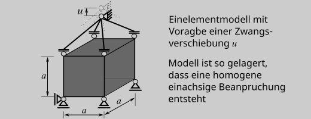
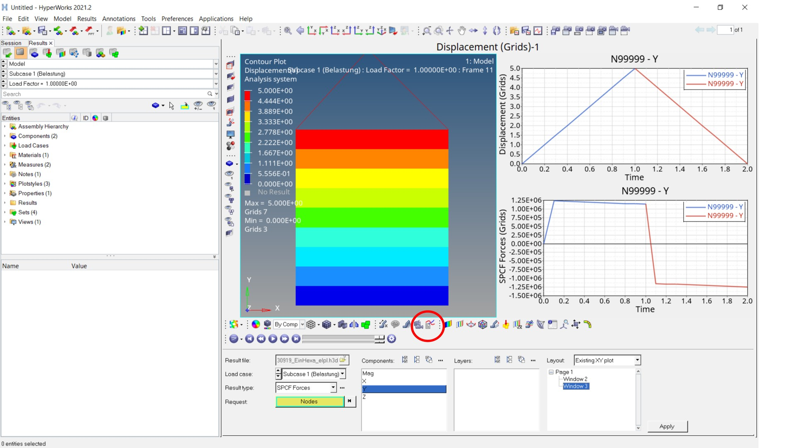
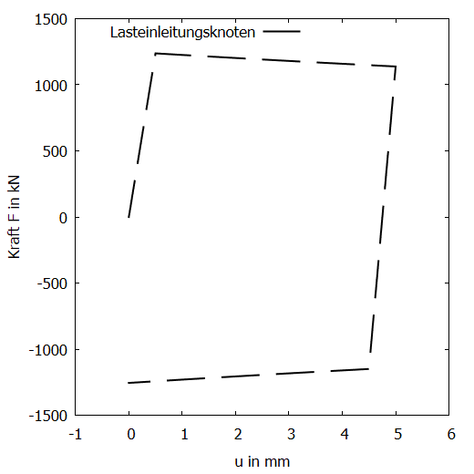
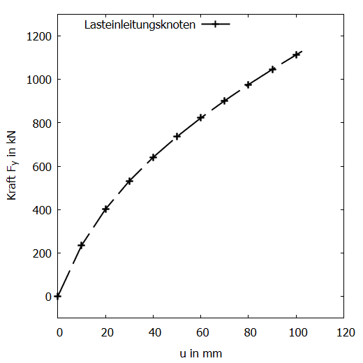

# FEM Übungsbeispiel 2: Einelementmodell

## Vorabbemerkungen
Übungsbeispiel für das FEM-Programm (solver) OptiStruct {cite}`opti2021-2`
- zum Ausprobieren unterschiedlicher Materialmodelle
- zum Kennenlernen der Wegregelung und des Einsatzes mehrerer Rechenschritte
Das Beispiel baut auf dem [Übungsbeispiel 1](/UebungBeam/UEBeam.md) auf

Die im Folgenden verwendeten .fem-Dateien *230919_EinHexa.fem* stehen über die [CampUas-Seite](https://campuas.frankfurt-university.de/course/view.php?id=1796) zur verfügung.

Das verwendete FE-Modell ist ein Würfel mit der Kantenlänge $a=50\text{mm}$, der nur durch ein 8-Knoten-Hexaederelement vom Typ *CHEXA* abgebildet wird. 
 



## Neue *Features* im Vergl. zum Übungsbeispiel 1

### Mehrere Lastfälle

Über das Schlüsselwort *SUBCASE* können mehrere Lastfälle definiert werden. Durch die Angabe *CNTNLSUB=YES* rechnet der aktuelle Lastfall auf Basis der Ergebnisse des vorherigen weiter (Ansonsten startet die Rechnung "von vorne"). In diesem Beispiel wird also zuerst die Load mit der *ID 21* aufgebracht und danach (da keine neue *LOAD* definiert wird, dieser Eintrag fehlt im zweiten Block) wieder zum Ausgangszustand zurückgerechnet (also entlastet). Die *ID 21* ist hier der Last vom Typ *SPCD* zugewiesen.
```
SUBCASE       1
  LABEL Belastung
$$ ========== Nonlinear Static ========
ANALYSIS NLSTAT
  SPC = 2
  NLPARM(LGDISP) = 1
  NLOUT = 1
  LOAD = 21
[...]
$$ ======================================  
$$
SUBCASE       2
  LABEL Entlastung
$$ ========== Nonlinear Static ========
ANALYSIS NLSTAT
  CNTNLSUB=YES
  SPC = 2
  NLPARM(LGDISP) = 1
  NLOUT = 1
[...]
```

### Verformung als Belastung

Bei nichtlinearem Modellverhalten, also hier durch das nichtlineare Materialverhalten, ist es für den Rechner einfacher Verformungslastfälle zu betrachten, als auf der Basis von Kräften zu rechnen. Dies erfolgt durch das Schlüsselwort *SPCD*, mit dem eine Knotenverformung am Knoten mit der *ID 99999* vorgegeben wird. Gleichzeitig sind in *OptiStruct* für diesen Knoten mindestens die Richtnugen zu lagern, in denen die Verformung aufgebracht wird (hier werden über *SPC* alle Freiheitsgrage festgehalten).

```
$$  SPC Data
$$ Verschiebungsrandbedinung:
SPCD,21,99999,2,30.
$$ Lagerung:
SPC,2,99999,123456,0.0
$$
```

### Materialmodelle

Ein elastisch-plastisches Materialverhalten wird über 

```
MAT1,331,200000.,,0.3,
MATS1,331,,PLASTIC,10.0,1,1,500
```

in dem Modell implementiert. Hyperelastisches Materialverhalten über
```
MATHE,332,MOONEY,,
,80.,20.,0.001
```

Was dort im Detail vorgegeben wird, gilt es über den [Altair OptiStruct Reference Guide](https://2021.help.altair.com/2021/hwsolvers/os/topics/solvers/os/ref_guide_os_c.htm) herauszufinden.


## Berechnung, Ergebnis und Auswertung

Für die weitere Berechnung ist die Eingabedatei *230919_EinHexa.fem* noch ein wenig zu editieren:

### elastisch-plastische Rechnung

Durch die Angabe des Materials hier mit der *ID 331* bei den Voluenelementeigenschaften (*PSOLID*) wird dem Element das elastisch-plastische Material zugewiesen. 

```
PSOLID,77,331
PSOLIDX,77,1
```

Bei dem elastisch-plastischen Materialverhalten stehen die metallsichen Werkstoffe Pate. Die Verformung wird daher auf 10% der Probengröße eingestellt (die Umformtechnik sieht das mit Sicherheit anders), also hier $0,1\cdot 50\text{mm}=5\text{mm}.

```
SPCD,21,99999,2,5.
```

Damit ergibt sich mit etwas Glück das folgende Ergebnis (Kurvendarsttellung in zwei *Windows*, zusammengesetzt aus je einer Linie pro "SUBCASE" für die Verformung, *Displacement*, und die Lagerreaktion, *SPCForce*, jeweils in y-Richtung.



```{dropdown} ... hier das ordentliche Diagramm

```

Zur Interpretation des Kraft Verformungsverhaltens sind die folgenden Kurven zum Vergleich sinnvoll:

- technischer Spannugs- und Dehnungsverlauf, berechnet aus dem Kraft-Verformungs-Verlauf 
- Spannungs-Dehungs-Verlauf als Ergebnis der Berechnung mit *OptiStruct*
- wahrer Spannugns-Dehnungs-Verlauf, berechnet aus dem Kraft-Verformungs-Verlauf 
- Spannugns-Dehnugns-Verlauf aus den vorgegebenen Werkstoffkennwerten

### hyperelastische Rechnung

Durch die Angabe des Materials hier mit der *ID 332* bei den Voluenelementeigenschaften (*PSOLID*) wird dem Element das elastisch-plastische Material zugewiesen. 

```
PSOLID,77,332
PSOLIDX,77,1
```

Da das hyperelastische Materialverhalten für große Verzerrungen gedacht ist, ist das Beispiel z.B. für eine Dehnung von $200%$ zu rechnen.

```
SPCD,21,99999,2,100.
```

Damit ergibt sich mit etwas Glück das folgende Ergebnis (Kurvendarsttellung in zwei *Windows*, zusammengesetzt aus je einer Linie pro "SUBCASE" für die Verformung (*Displacement*) und die Lagerreaktion (*SPCForce*) in y-Richtung.


```{dropdown} ... hier das ordentliche Diagramm

```

Zur Interpretation des Kraft Verformungsverhaltens sind die folgenden Kurven zum Vergleich sinnvoll:

- technischer Spannugs- und Dehnungsverlauf, berechnet aus dem Kraft-Verformungs-Verlauf 
- Spannungs-Dehungs-Verlauf als Ergebnis der Berechnung mit OptiStruct
- wahrer Spannugns-Dehnungs-Verlauf, berechnet aus dem Kraft-Verformungs-Verlauf 
- Spannugns-Dehnugns-Verlauf aus den vorgegebenen Werkstoffkennwerten

Viel Spaß beim Vergleichen!
