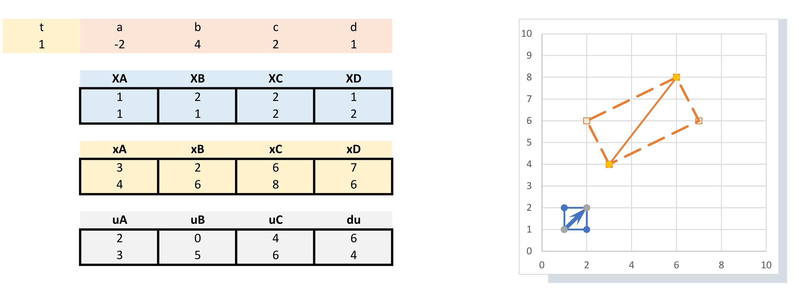

# Übungsbeispiel: Deformationsgradient

## Vorabbemerkungen
Das Beispiel dient zur Veranschaulichung und Interpretation des Deformationsgradienten und der daraus abgeleiteten Verzerrungstensoren

## Beispiel 01
Gegeben ist die folgende Bewegung (2 dim.):  
$\boldsymbol{x}=x_i=\begin{bmatrix}
x_1\\
x_2\\
\end{bmatrix} $ mit  
${x}_1=(a\cdot t+1)X_1+b\cdot t X_2$
${x}_2=c\cdot t X_1+(d\cdot t+1) X_2$  
wobei sich über die Zeit $t$ die Verformung ensprechend skaliert. 

### Stellen Sie die entsprechende Verformung eines Vierecks dar
Um die Bewegung besser zu Interpretieren, stellen Sie die sich für die Eckpunkte eines Vierecks ergebende Verformung dar. Das Viereck ist sozusagen der Körper, dessen Bewegung mit den Gleichungen beschrieben wird.  
Definieren Sie also vier beliebige Eckpunkte $boldsybol{X}^A$, $boldsybol{X}^B$, $boldsybol{X}^C$, $boldsybol{X}^D$.  
Berechnen Sie deren neue Koordinaten $boldsybol{x}^A$, $boldsybol{x}^B$, $boldsybol{x}^C$, $boldsybol{x}^D$ für beliebige Werte für $a$, $b$, $c$, $d$ und die Zeit $t$,  
Berechnen Sie die Verschiebungsvektoren $boldsybol{u}^A$, ... der Eckpunkte und stellen Sie die Ausgangs- und die Momentankonfiguration (verformtes Viereck) dar.  


```{dropdown} hier ist ein Beispiel für die Umsetzung in EXCEL

```